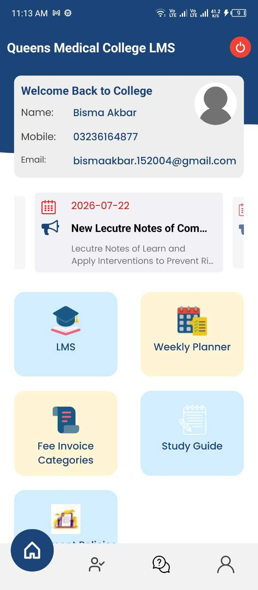
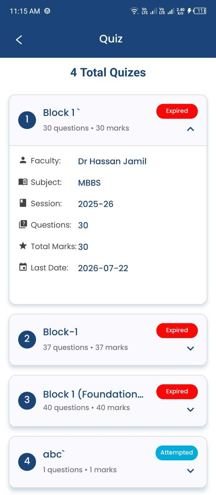
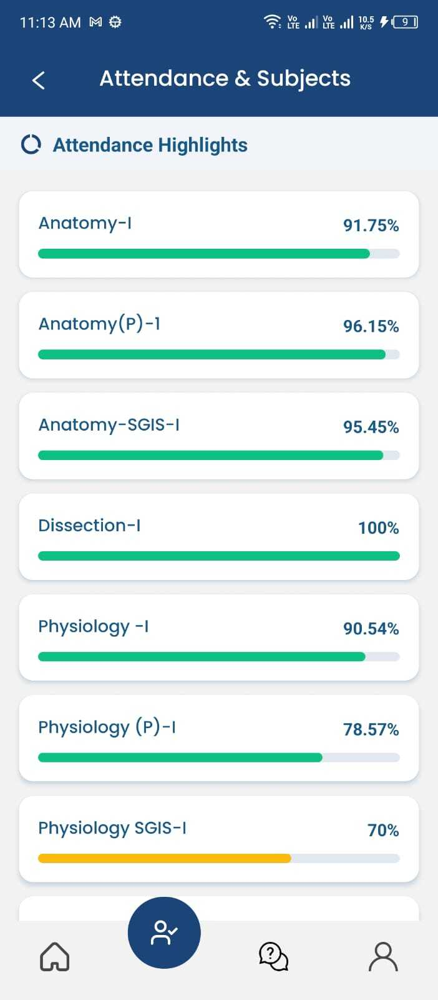
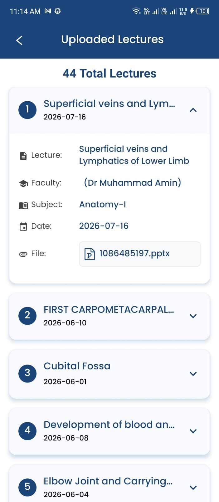
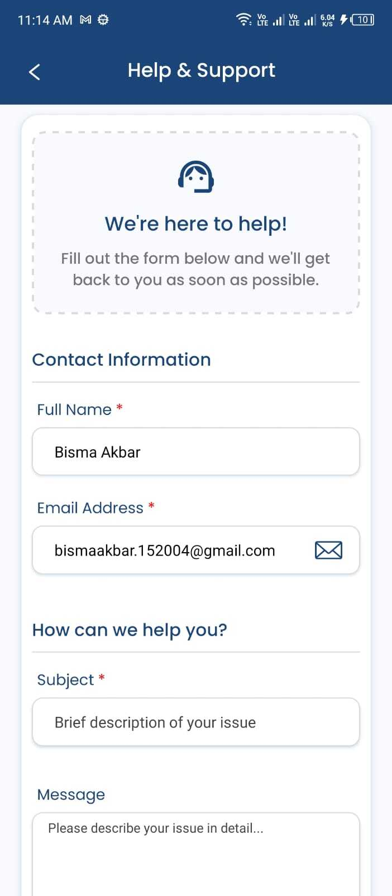

# Tutor LMS — Learning Management App for Tutors & Students

> **Note:** This repository is a case study, not a source dump. It was built at work for a production client product; the source is proprietary. This README documents the architecture, my role, and the engineering decisions behind it.

 

## Overview

Tutor LMS is a React Native mobile app for instructors and training institutes to run teaching and learning from one place. Tutors start lecture sessions, mark attendance, and manage course content — lecture notes, video tutorials, quizzes, and assignments. Students (role-based) attempt timed quizzes, submit assignments, and access learning materials.

The app also covers a daily/weekly planner, announcements, fee invoice tracking, a help desk, and push notifications — built against a REST API with configurable institute branding, so the same app can be white-labeled per institute.

## My Role

Solo mobile developer — owned the React Native app end to end: screens, navigation, API integration, state, and feature delivery.

## Tech Stack

| Layer | Technologies |
|---|---|
| Mobile | React Native 0.72, React 18, TypeScript/JavaScript |
| State / API | Redux Toolkit, React Redux, Axios |
| Navigation | React Navigation (stack, drawer, bottom tabs) |
| Auth / Push | Firebase Auth & Messaging, Notifee |
| Forms / UX | Formik, Yup, React Native Paper, Reanimated, Lottie |
| i18n | i18next / react-i18next (English + Arabic) |
| Media | react-native-video, YouTube iframe, WebView, document picker, Fast Image, render-HTML |
| Charts / Calendar | react-native-chart-kit, calendars, big-calendar, circular progress |

## Architecture

```
┌───────────────────────────┐        REST (Axios)       ┌───────────────────┐
│      React Native App       │ ─────────────────────────▶│   Institute API     │
│  Role-based UI:             │◀───────────────────────── │  (multi-tenant,     │
│   • Instructor dashboard    │                            │   configurable      │
│   • Student dashboard       │                            │   branding)         │
└──────────────┬───────────────┘                          └───────────────────┘
               │
     ┌─────────┼─────────────────┐
     ▼         ▼                 ▼
  Quizzes   Attendance      SmartBot AI
 (timers,   (session-based   (chat history
  anti-      start/end)       via API)
  screenshot)
```

## Standout Features

- **Timed Quizzes** — countdown timers, optional per-question time limits, and screenshot blocking during attempts to reduce cheating.
- **SmartBot AI Assistant** — an in-app chatbot for instructors with persistent conversation history (create/update chat via API).
- **Session-Based Attendance** — start/end lecture sessions and mark students present/absent per session.
- **Full LMS Hub** — upload and manage lecture notes, video tutorials, quizzes, and assignments; publish grades and results.
- **Fee Invoice Flows** — paid, unpaid, and to-be-verified invoice lists.
- **Role-Based UI** — distinct instructor vs. student experiences from a single codebase, with multi-language support (English/Arabic).
- **Institute-Configurable Branding** — dynamic config and base URLs so the same app white-labels per institute.

## Screenshots

<!-- Add images to a screenshots/ folder and reference them below -->

| Student Dashboard | Timed Quiz | Session Attendance |
|---|---|---|
|  |  |  |

| Course/Content Hub | Help & Support |
|---|---|---|
|  |  |

## What I'd Improve Next

- Migrate quiz anti-cheat from screenshot blocking alone to also detecting app backgrounding during an attempt
- Add offline caching for lecture materials so students in low-connectivity areas aren't blocked from content
